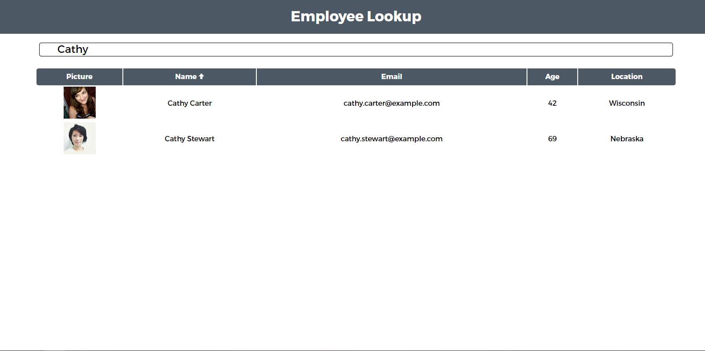

# React-Employee-Directory
Assignment 19 of my UWA Bootcamp React Employee Directory.

This assignment focused upon taking data from an API and processing it with filtering and sorting displaying it to the user. Instead of using pop drilling I decided to use reacts content providing state to components without using class components.

The user is able to:

  * Sort the table by at least one category which is name.

  * Filter the users by at least one property which is also their name.

Live: https://react-employees-directory.herokuapp.com/

## Available Scripts

In the project directory, you can run:

### `npm start`

Runs the app in the development mode. 
Open [http://localhost:3000](http://localhost:3000) to view it in the browser.

The page will reload if you make edits. 
You will also see any lint errors in the console.

### `npm test`

Launches the test runner in the interactive watch mode. 
See the section about [running tests](https://facebook.github.io/create-react-app/docs/running-tests) for more information.

### `npm run build`

Builds the app for production to the `build` folder. 
It correctly bundles React in production mode and optimizes the build for the best performance.
